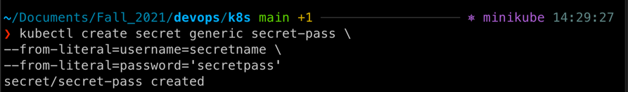
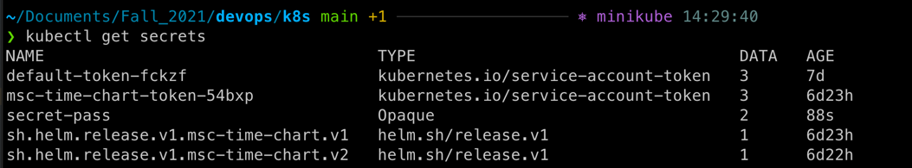
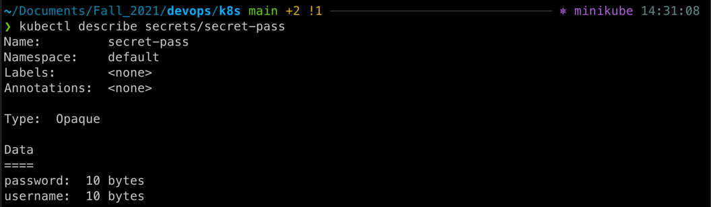
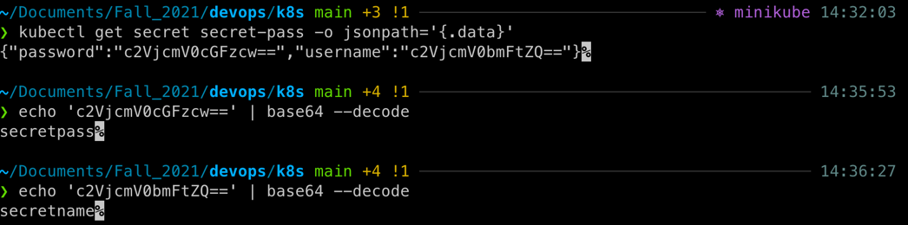
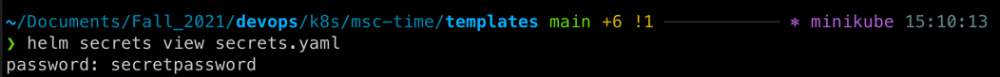
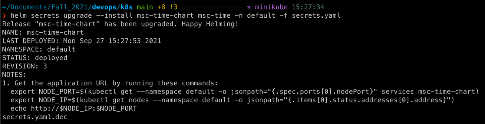
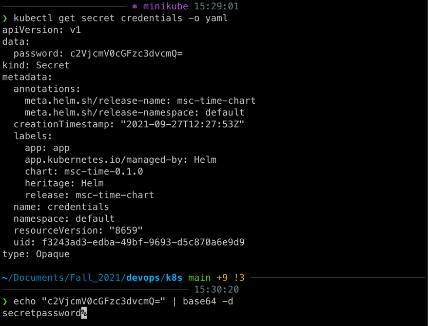
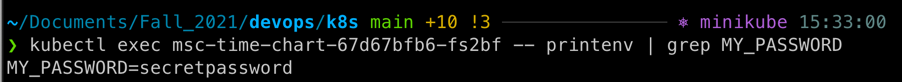
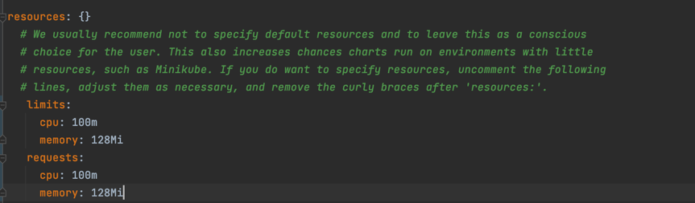

###Create a secret from literal:

*I know that I shouldn't display such stuff in the report ot in the public repository. But since I have a fake secret, I've included this screenshot.
###Secret verification:

###Some description of the secret:

###Decoding the secret(back from base64):

###Created and decrypted secret with Helm:

###Upgraded the deployment:

###Verification:

### Printing environment variables and grabbing the password only:

To set up requests and limits for CPU and memory I have uncommented the following lines in `values.yaml`:
