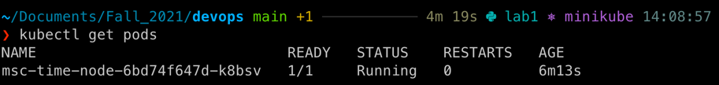
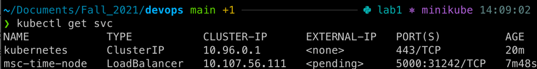
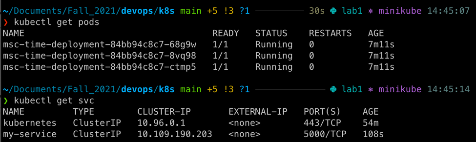
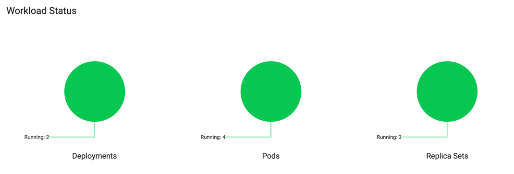
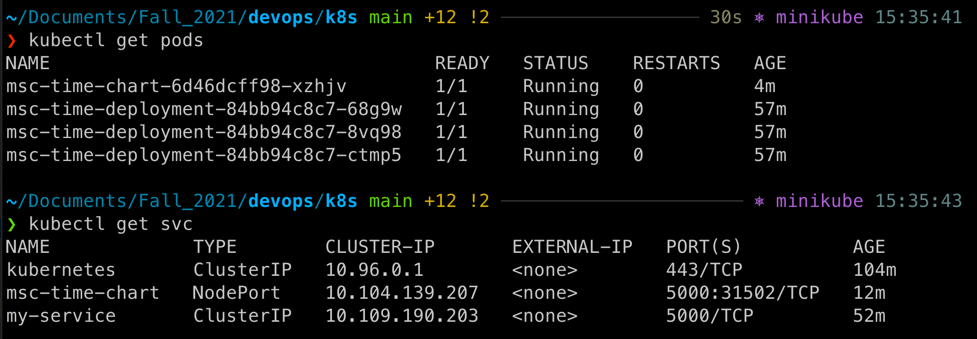

##Deployment via CLI
The output of `kubectl get pods` command:

The output of `kubectl get svc` command:

##Deployment via config files `deployment.yml` and `service.yml`
The output of commands `kubectl get pods,svc`:

#Helm
Workload status:

The output of commands `kubectl get pods,svc`:
