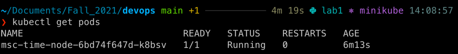
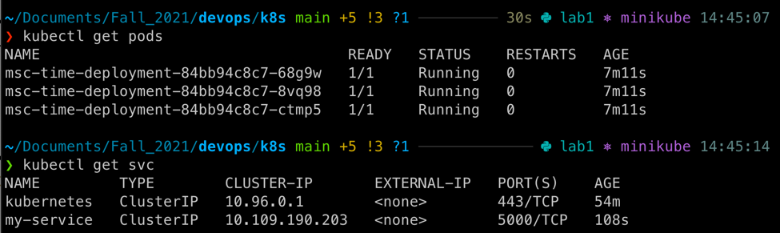

#Deployment via CLI
2. The output of `kubectl get pods` command:

3. The output of `kubectl get svc` command:

#Deployment via config files `deployment.yml` and `service.yml`
The output of commands `kubectl get pods,svc`:

