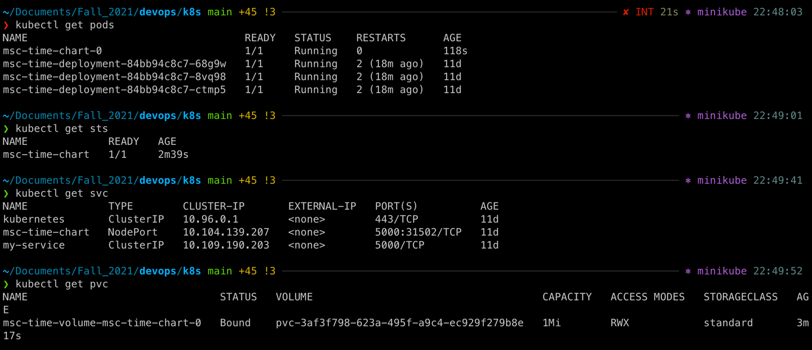

The output of the commands `kubectl get po,sts,svc,pvc`:

The output of the `minikube service msc-time-chart`:

The output of the commands `kubectl get po,sts,svc,pvc` after I upgraded chart and now there are three replicas:

The output of the following command `kubectl exec nameofthepod -- cat /volume/visits.txt` is different due to the different creation time of the pods. Kubernetes does liveness probes to the pods to check if they are alive, which also updates the counter of visits. The older a pod exists the more visits it has. Two new pods have the same number of visits because they were created at the same time and I didn't access them after creation. But if I try accessing from different tabs the counters may dissynchronize on all of the pods:

For our app ordering guarantee are unnecessary because our system requiers only uniqueness and identity.

To make statefulset controller launch and terminate pods at the same time I have added `podManagementPolicy: "Parallel"` to the `spec` inside the `statefulset.yaml`.

For the updates to work run `kubectl delete statefulsets.apps msc-time-chart` command and then upgrade the chart with `helm secrets upgrade --install msc-time-chart msc-time -f secrets.yaml` command

Now we have all the pods created at the same time:

