# Kube Prometheus Stack
## Components 
### Prometheus Operator
### Highly available Prometheus
### Highly available Alertmanager
### Prometheus node-exporter
### Prometheus Adapter for Kubernetes Metrics APIs
### kube-state-metrics
### Grafana

# Report 
##Resources
We can see that Prometheus stack created 5 more pods:
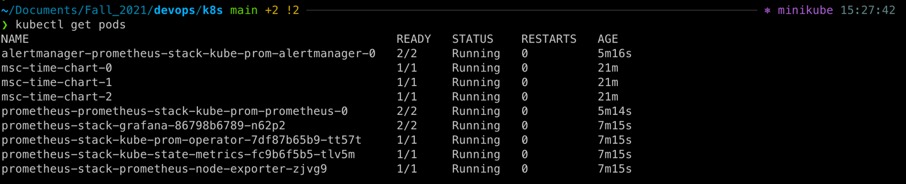
We can see that Prometheus stack created 2 more stateful sets:
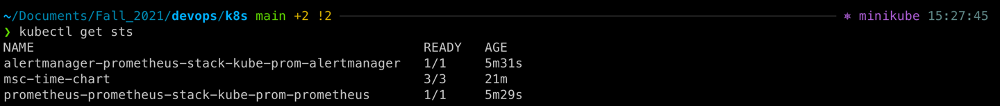
We can see that Prometheus stack created 8 more services:
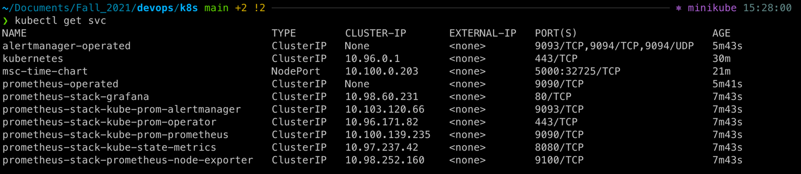
We can see that Prometheus stack didn't create new persistent volume claims by default:
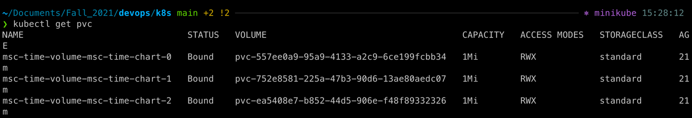
We can see that Prometheus stack created 30 more config maps:
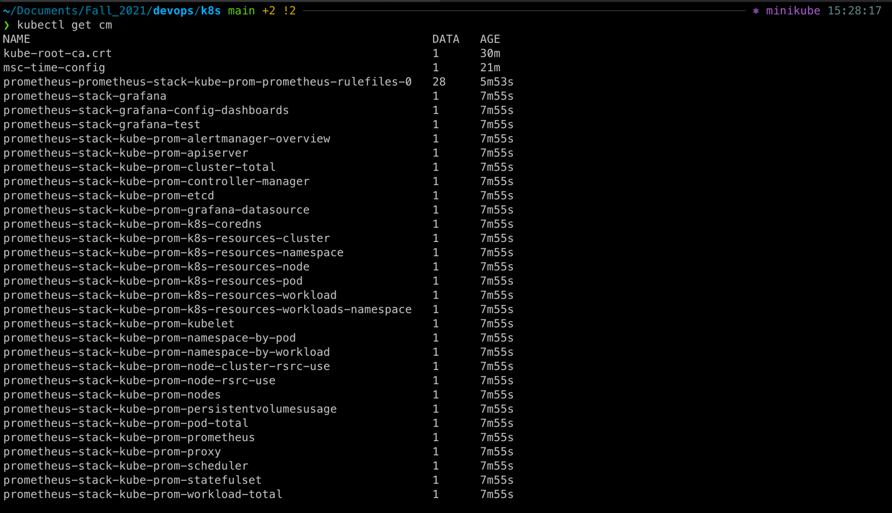
##Grafana
1. Check how much CPU and Memory your StatefulSet is consuming.
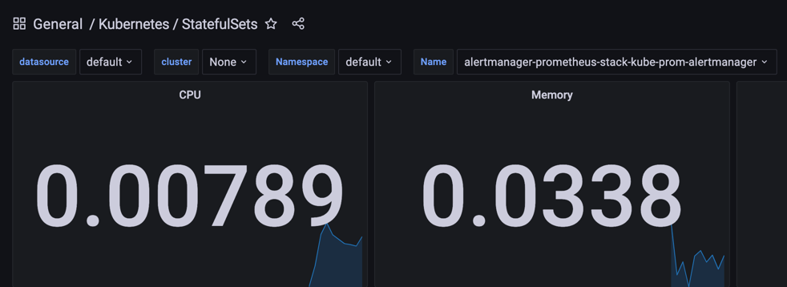
2. Check which Pod is using CPU more than others and which is less in the default namespace.

According to the table inside `/Kubernetes / Compute Resources / Namespace (Pods)` thid pod `prometheus-prometheus-stack-kube-prom-prometheus-0` uses more CPU:
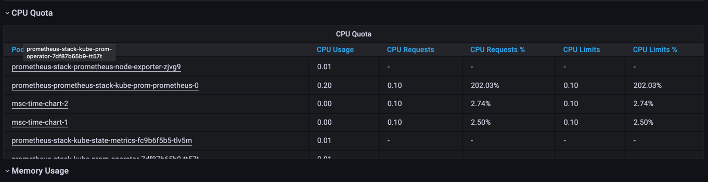
4. Check how much memory is used on your node, in % and mb

Taken from `/ Kubernetes / Compute Resources / Node (Pods)`:
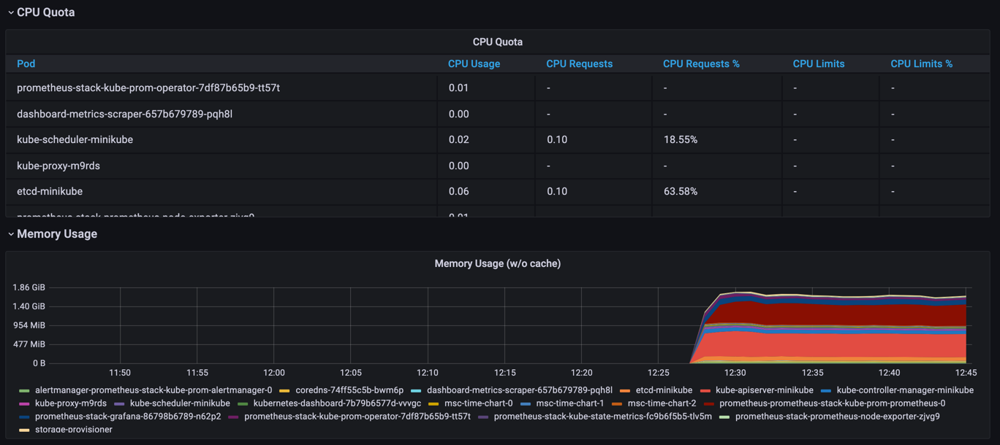
4. Check how many pods and containers actually ran by the Kubelet service.

18 running pods:
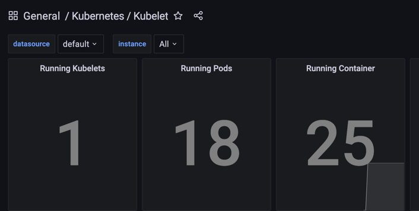

5. Check which Pod is using network more than others and which is less in the default namespace

`kube-proxy-m9rds` & `storage-provisioner` uses network more than others and `coredns-74ff55c5b-bwm6p` uses less than others.
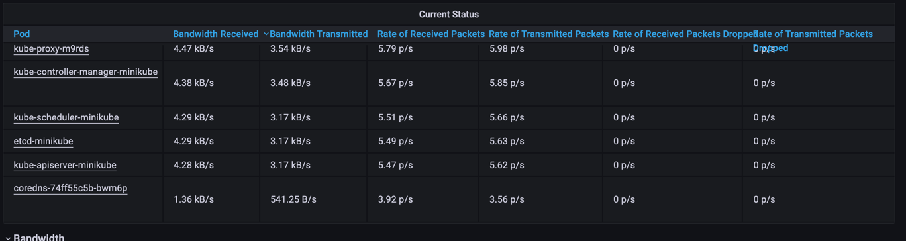
6. Check how many alerts you have

8 alerts by now:
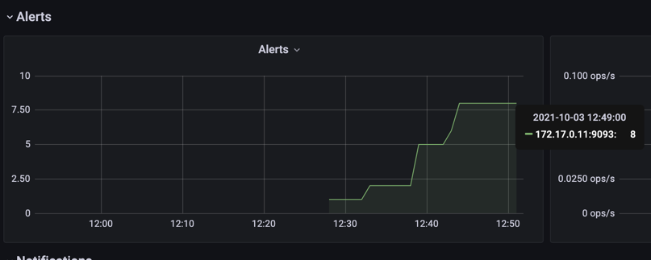

##Init Containers
The result of wget command:
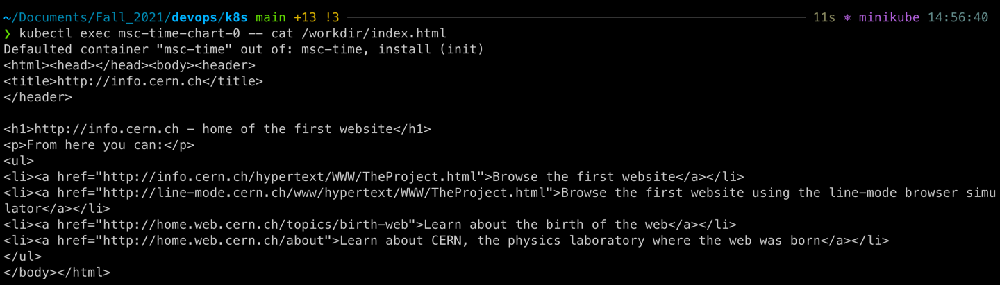
