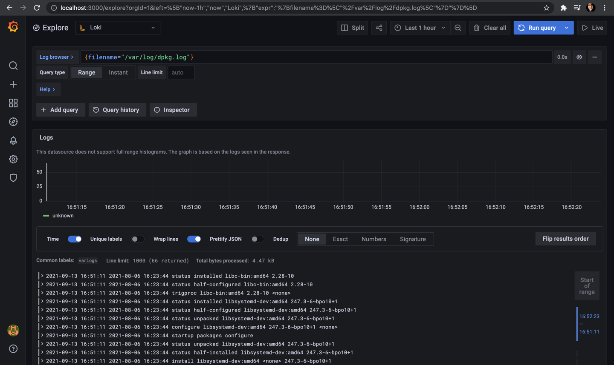
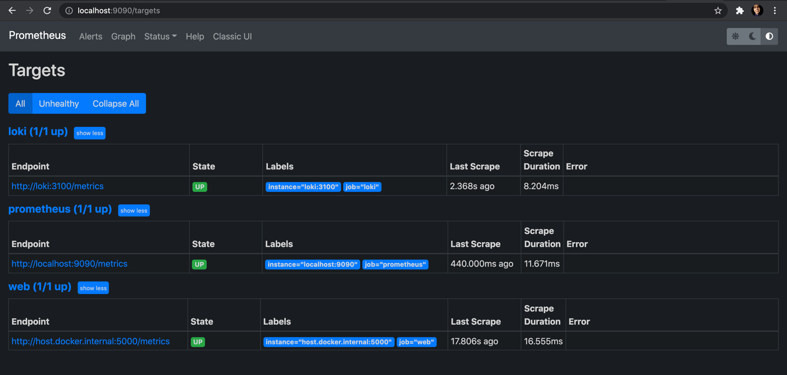
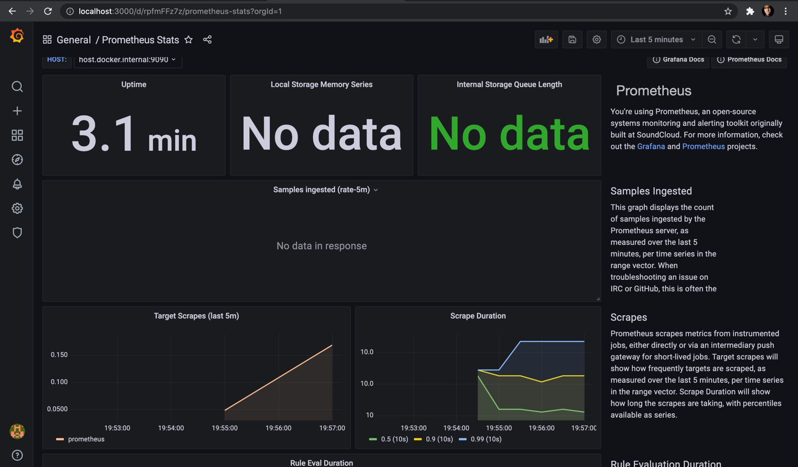

#Lab 7 report

##Prerequisites 
* Docekr
* GitHub

##Loki setup
###Steps
1) Clone the Loki repository
```
git clone https://github.com/grafana/loki.git
```
2) Go to `Production` directory inside `loki` and pull `docker-compose.yaml`
```
cd loki/production
docker-compose pull
```
3) By previous command we get the "docker-compose.yml" file with latest Loki, Promtail and Grafana images. 
4) Create config files in the folder `monitoring` for `Loki` and `Promtail`.

5) Change the `docker-compose.yml` according to your needs
* add your application to services
* mount new config files inside the images
* 
6) To run those images use the following command:
```
docker-compose up
```

7) To see the logs via Grafana dashboard go to ` http://localhost:3000/` and log in with `admin` username and `admin` password.

8) Inside Grafana add Loki `data source` with URL `http://loki:3100`


###Best Practices 

Using `json-file` as logging driver and tagging.

##Prometheus setup
###Steps
1) Add config file for Prometheus 
2) Update `docker-compose.yml` accordingly
* add new service Prometheus
* add log rotation
* add mem limits 
3) Update python app, so it generates metrics for Prometheus 
4) Update Docker Hub image
5) Run
```
docker-compose up
```
6) screenshot from `localhost:9090/targets`

7) Dashboard for Prometheus:
8) Dashboard for Loki:


###Best Practices
* Used `host.docker.internal` instead of `localhost` for the app inside the Prometheus configuration file
* Used ready dashboard (imported)


